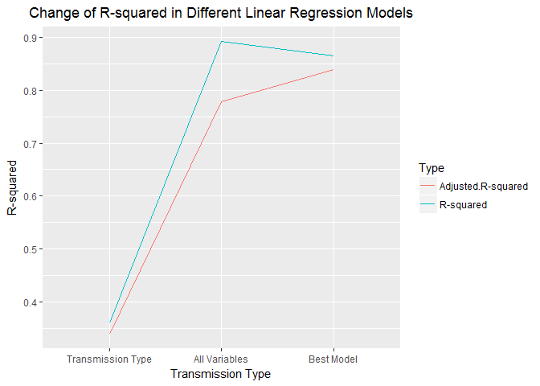

Course Project
==============

Regression Models by Johns Hopkins University
---------------------------------------------

### Introduction

This project is performed for a magazine about the automobile industry
called "Motor Trend". We will analyze the **Motor Trend Car Road Tests**
data from R datasets package. It contains a data set of a collection of
cars, and we are interested in exploring the relationship between a set
of variables and miles per gallon (MPG). We are particularly interested
in the following two questions:

-   "Is an automatic or manual transmission better for MPG"
-   "Quantify the MPG difference between automatic and manual
    transmissions"

### Data

The data was extracted from the 1974 Motor Trend US magazine, and
comprises fuel consumption and 10 aspects of automobile design and
performance for 32 automobiles (1973-74 models).

Dataset contains 32 observations on 11 variables:

-   **mpg:** Miles/(US) gallon
-   **cyl:** Number of cylinders
-   **disp:** Displacement (cu.in.)
-   **hp:** Gross horsepower
-   **drat:** Rear axle ratio
-   **wt:** Weight (1000 lbs)
-   **qsec:** 1/4 mile time
-   **vs:** V/S
-   **am:** Transmission (0 = automatic, 1 = manual)
-   **gear:** Number of forward gears
-   **carb:** Number of carburetors

So, we first load the mtcars data to R, and take a look at the
variables:

    data(mtcars)
    mtcars$am <- as.factor(mtcars$am)
    mtcars$cyl <- as.factor(mtcars$cyl)
    mtcars$vs <- as.factor(mtcars$vs)
    mtcars$gear <- as.factor(mtcars$gear)
    mtcars$carb <- as.factor(mtcars$carb)
    str(mtcars)

    ## 'data.frame':    32 obs. of  11 variables:
    ##  $ mpg : num  21 21 22.8 21.4 18.7 18.1 14.3 24.4 22.8 19.2 ...
    ##  $ cyl : Factor w/ 3 levels "4","6","8": 2 2 1 2 3 2 3 1 1 2 ...
    ##  $ disp: num  160 160 108 258 360 ...
    ##  $ hp  : num  110 110 93 110 175 105 245 62 95 123 ...
    ##  $ drat: num  3.9 3.9 3.85 3.08 3.15 2.76 3.21 3.69 3.92 3.92 ...
    ##  $ wt  : num  2.62 2.88 2.32 3.21 3.44 ...
    ##  $ qsec: num  16.5 17 18.6 19.4 17 ...
    ##  $ vs  : Factor w/ 2 levels "0","1": 1 1 2 2 1 2 1 2 2 2 ...
    ##  $ am  : Factor w/ 2 levels "0","1": 2 2 2 1 1 1 1 1 1 1 ...
    ##  $ gear: Factor w/ 3 levels "3","4","5": 2 2 2 1 1 1 1 2 2 2 ...
    ##  $ carb: Factor w/ 6 levels "1","2","3","4",..: 4 4 1 1 2 1 4 2 2 4 ...

### Exploratory Data Analyses

At this step, we perform some basic exploratory data analyses:

    summary(mtcars)

    ##       mpg        cyl         disp             hp             drat      
    ##  Min.   :10.40   4:11   Min.   : 71.1   Min.   : 52.0   Min.   :2.760  
    ##  1st Qu.:15.43   6: 7   1st Qu.:120.8   1st Qu.: 96.5   1st Qu.:3.080  
    ##  Median :19.20   8:14   Median :196.3   Median :123.0   Median :3.695  
    ##  Mean   :20.09          Mean   :230.7   Mean   :146.7   Mean   :3.597  
    ##  3rd Qu.:22.80          3rd Qu.:326.0   3rd Qu.:180.0   3rd Qu.:3.920  
    ##  Max.   :33.90          Max.   :472.0   Max.   :335.0   Max.   :4.930  
    ##        wt             qsec       vs     am     gear   carb  
    ##  Min.   :1.513   Min.   :14.50   0:18   0:19   3:15   1: 7  
    ##  1st Qu.:2.581   1st Qu.:16.89   1:14   1:13   4:12   2:10  
    ##  Median :3.325   Median :17.71                 5: 5   3: 3  
    ##  Mean   :3.217   Mean   :17.85                        4:10  
    ##  3rd Qu.:3.610   3rd Qu.:18.90                        6: 1  
    ##  Max.   :5.424   Max.   :22.90                        8: 1

    table(mtcars$am)

    ## 
    ##  0  1 
    ## 19 13

According to the above table, we have 19 automatic and 13 manual
transmission cars in the dataset. Furthermore, in the below plot you can
see the distribution of mpg in the dataset:

    hist(mtcars$mpg, breaks = 15, xlab = "MPG", main = "Distribution of MPG", col = "lightgreen", xlim = c(10,35))

    plot <- ggplot(mtcars, aes(x = am, y = mpg)) + geom_boxplot(aes(fill = am)) + labs(x = "TRANSMISSION TYPE", y = "MPG")
    plot

    t.test(mpg ~ am, data = mtcars)

    ## 
    ##  Welch Two Sample t-test
    ## 
    ## data:  mpg by am
    ## t = -3.7671, df = 18.332, p-value = 0.001374
    ## alternative hypothesis: true difference in means is not equal to 0
    ## 95 percent confidence interval:
    ##  -11.280194  -3.209684
    ## sample estimates:
    ## mean in group 0 mean in group 1 
    ##        17.14737        24.39231

In addition, according to the above box plot, automatic transmissions
have lower MPG compared to manual transmission cars. Above t-test also
confirms this finding since the p-value is below 0.05 and confidence
interval is entirely below zero. Therefore, we can conclude that manual
transmission cars have better fuel efficiency than cars with automatic
transmissions. In the next section, we will perform regression analysis
to see if that is in fact the case.

### Regression Analyses

In this part, we use regression analysis to see the relation between
transmission type and MPG. First of all, we use only the transmission
type to predict the MPG:

    fit.am <- lm(mpg ~ am, data = mtcars)
    summary(fit.am)

    ## 
    ## Call:
    ## lm(formula = mpg ~ am, data = mtcars)
    ## 
    ## Residuals:
    ##     Min      1Q  Median      3Q     Max 
    ## -9.3923 -3.0923 -0.2974  3.2439  9.5077 
    ## 
    ## Coefficients:
    ##             Estimate Std. Error t value Pr(>|t|)    
    ## (Intercept)   17.147      1.125  15.247 1.13e-15 ***
    ## am1            7.245      1.764   4.106 0.000285 ***
    ## ---
    ## Signif. codes:  0 '***' 0.001 '**' 0.01 '*' 0.05 '.' 0.1 ' ' 1
    ## 
    ## Residual standard error: 4.902 on 30 degrees of freedom
    ## Multiple R-squared:  0.3598, Adjusted R-squared:  0.3385 
    ## F-statistic: 16.86 on 1 and 30 DF,  p-value: 0.000285

As you can see, transmission type is a significant factor in the model
and manual transmission causes a 7.245 increase in MPG. However,
adjusted R-square is 0.3385 which means that only 33.85% of the
variation in MPG is explained by the transmission type. Now let's use
all available variables and see if we can predict the change in MPG
variable better:

    fit.all <- lm(mpg ~ ., data = mtcars)
    summary(fit.all)

    ## 
    ## Call:
    ## lm(formula = mpg ~ ., data = mtcars)
    ## 
    ## Residuals:
    ##     Min      1Q  Median      3Q     Max 
    ## -3.5087 -1.3584 -0.0948  0.7745  4.6251 
    ## 
    ## Coefficients:
    ##             Estimate Std. Error t value Pr(>|t|)  
    ## (Intercept) 23.87913   20.06582   1.190   0.2525  
    ## cyl6        -2.64870    3.04089  -0.871   0.3975  
    ## cyl8        -0.33616    7.15954  -0.047   0.9632  
    ## disp         0.03555    0.03190   1.114   0.2827  
    ## hp          -0.07051    0.03943  -1.788   0.0939 .
    ## drat         1.18283    2.48348   0.476   0.6407  
    ## wt          -4.52978    2.53875  -1.784   0.0946 .
    ## qsec         0.36784    0.93540   0.393   0.6997  
    ## vs1          1.93085    2.87126   0.672   0.5115  
    ## am1          1.21212    3.21355   0.377   0.7113  
    ## gear4        1.11435    3.79952   0.293   0.7733  
    ## gear5        2.52840    3.73636   0.677   0.5089  
    ## carb2       -0.97935    2.31797  -0.423   0.6787  
    ## carb3        2.99964    4.29355   0.699   0.4955  
    ## carb4        1.09142    4.44962   0.245   0.8096  
    ## carb6        4.47757    6.38406   0.701   0.4938  
    ## carb8        7.25041    8.36057   0.867   0.3995  
    ## ---
    ## Signif. codes:  0 '***' 0.001 '**' 0.01 '*' 0.05 '.' 0.1 ' ' 1
    ## 
    ## Residual standard error: 2.833 on 15 degrees of freedom
    ## Multiple R-squared:  0.8931, Adjusted R-squared:  0.779 
    ## F-statistic:  7.83 on 16 and 15 DF,  p-value: 0.000124

When we use all the available variables to create a model, we can
explain 77.9% of the variation in MPG. However, rather than using every
variable provided in a dataset, sometimes we can predict a variable
better with a subset of variables. So, in the next step we try to find
the best linear regression model that can predict MPG:

    fit.best <- step(fit.all, direction="both", trace=0)
    summary(fit.best)

    ## 
    ## Call:
    ## lm(formula = mpg ~ cyl + hp + wt + am, data = mtcars)
    ## 
    ## Residuals:
    ##     Min      1Q  Median      3Q     Max 
    ## -3.9387 -1.2560 -0.4013  1.1253  5.0513 
    ## 
    ## Coefficients:
    ##             Estimate Std. Error t value Pr(>|t|)    
    ## (Intercept) 33.70832    2.60489  12.940 7.73e-13 ***
    ## cyl6        -3.03134    1.40728  -2.154  0.04068 *  
    ## cyl8        -2.16368    2.28425  -0.947  0.35225    
    ## hp          -0.03211    0.01369  -2.345  0.02693 *  
    ## wt          -2.49683    0.88559  -2.819  0.00908 ** 
    ## am1          1.80921    1.39630   1.296  0.20646    
    ## ---
    ## Signif. codes:  0 '***' 0.001 '**' 0.01 '*' 0.05 '.' 0.1 ' ' 1
    ## 
    ## Residual standard error: 2.41 on 26 degrees of freedom
    ## Multiple R-squared:  0.8659, Adjusted R-squared:  0.8401 
    ## F-statistic: 33.57 on 5 and 26 DF,  p-value: 1.506e-10

As you can see, using only four variables (cyl, hp, wt, and am) we can
explain 84.01% of the variation in MPG which is more than the previous
model where we used all variables.

    t <- data.frame("Model" = c("Transmission Type", "All Variables", "Best Model", "Transmission Type", "All Variables", "Best Model"), "R.Squared" = c(summary(fit.am)$r.squared, summary(fit.all)$r.squared, summary(fit.best)$r.squared, summary(fit.am)$adj.r.squared, summary(fit.all)$adj.r.squared, summary(fit.best)$adj.r.squared), "Type" = c("R-squared","R-squared","R-squared","Adjusted.R-squared","Adjusted.R-squared","Adjusted.R-squared"))
    t$Model <- factor(t$Model, levels=c("Transmission Type", "All Variables", "Best Model"))

    t1 <- data.frame("Model" = c("Transmission Type", "All Variables", "Best Model"), "Sigma" = c(summary(fit.am)$sigma, summary(fit.all)$sigma, summary(fit.best)$sigma))
    t1$Model <- factor(t1$Model, levels=c("Transmission Type", "All Variables", "Best Model"))

    plot <- ggplot(t, aes(x = Model, y = R.Squared)) +  geom_line(aes(colour = Type, group = Type)) + xlab("Transmission Type") + ylab("R-squared") + ggtitle("Change of R-squared in Different Linear Regression Models") + theme(plot.title = element_text(hjust = 0.5))
    plot

As you can see in the above plot, even though we observe increasing
adjusted R-squared as we modify our models, R-squared in the third model
is less than the second model. When comparing different models, we use
adjusted R-squared measures rather than R-squared because that has been
adjusted for the number of predictors in the model.

Furthermore, you can see the change in residual standard error in the
below plot. We observe the minimum residual standard error in the third
model, so we select the third model as our final model.

    plot <- ggplot(t1, aes(x = Model, y = Sigma)) +  geom_line(aes(group = 1), col = "red") + xlab("Transmission Type") + ylab("Residual Standard Error") + ggtitle("Change of Residual Standard Error in Different Models") + theme(plot.title = element_text(hjust = 0.5))
    plot

### Final Model Diagnostic Analyses

    par(mfrow = c(2,2))
    plot(fit.best)

In this part we perform some basic diagnostic analyses:

-   According to the Residuals vs. Fitted plot, points are pretty
    symmetrically distributed, and in general there aren't
    clear patterns. So we can conclude that points are random (not
    depending on fitted values) and thus the plot supports the
    assumption of independence.

-   Again the points are randomly distributed in the Scale-Location plot
    which confirms the constant variance assumption.

-   We observe a small curve in the plots which seems to be resulted
    from the influence of several car types. These car types are called
    out on the plots such as Chrysler Imperial, Toyota Corolla, and
    Fiat 128.

-   According to the Normal Q-Q plot, the residuals are normally
    distributed since the points lie closely to the line.

-   In the Residuals vs. Leverage plot all points are within the 0.5
    bands, therefore we can conclude that no outliers are present.

### Final Model Interpretation

In our final model, we can see how MPG is effected by changes in cyl,
hp, wt, and transmission type. According to the below estimated
coefficients:

-   When **cyl = 6** (and other variables are fixed), we observe an
    **3.03134 decrease** in MPG
-   When **cyl = 8** (and other variables are fixed), we observe an
    **2.16368 decrease** in MPG
-   One unit **increase in hp** (when other variables are fixed) leads
    to an **0.03211 decrease** in MPG
-   One unit **increase in wt** (when other variables are fixed) leads
    to an **2.49683 decrease** in MPG
-   When the transmission is **manual** (and other variables are fixed),
    we observe an **1.80921 increase** in MPG

<!-- -->

    summary(fit.best)$coefficients

    ##                Estimate Std. Error   t value     Pr(>|t|)
    ## (Intercept) 33.70832390 2.60488618 12.940421 7.733392e-13
    ## cyl6        -3.03134449 1.40728351 -2.154040 4.068272e-02
    ## cyl8        -2.16367532 2.28425172 -0.947214 3.522509e-01
    ## hp          -0.03210943 0.01369257 -2.345025 2.693461e-02
    ## wt          -2.49682942 0.88558779 -2.819404 9.081408e-03
    ## am1          1.80921138 1.39630450  1.295714 2.064597e-01

    summary(fit.best)$coefficients[6,1] + c(-1, 1) * qt(.975, df = fit.best$df) * summary(fit.best)$coefficients[6,2]

    ## [1] -1.060934  4.679356

According to this model, manual transmission increases the MPG by
1.80921. However, it seems that cyl, hp and wt are statistically more
significant when determining MPG. We saw that transmission type was
statistically significant in the first model when it's effect on MPG was
considered alone. However, when we consider the effect that other
variables have on MPG, transmission's effect is reduced. According to
the final model, we cannot say that manual transmission is better for
MPG since the estimated coefficient is between \[-1.060934 - 4.679356\]
interval with 95% confidence and the interval contains zero.
Furthermore, p-value of the am1 variable is 0.20646 which is larger than
0.05. So, transmission type is not statistically significant when
determining MPG.
